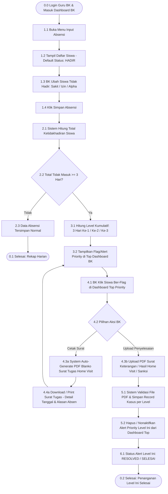

# 📄 Product Requirement Document (PRD)
## Sistem Informasi Presensi Siswa & Manajemen Kasus Ketidakhadiran (Modul BK)

| Attributes | Details |
| :--- | :--- |
| **Document Version** | 2.0.0 (Single-User BK Dedicated) |
| **Status** | Approved / Ready for Development |
| **Target User** | Guru BK (Single Role / Pengguna Tunggal) |
| **Core Module** | Top Priority Dashboard, Presensi Harian (Default HADIR), Home Visit PDF Generator, PDF Case Resolution, Arsip Kasus |
| **Specification Format** | Markdown, Mermaid.js & Google Sheets Schema (Bahasa Indonesia) |

---

## 📋 Table of Contents
1. [Executive Summary](#1-executive-summary)
2. [Product Vision & Objectives](#2-product-vision--objectives)
3. [User Persona & Single-Role Concept](#3-user-persona--single-role-concept)
4. [Situs Menu & Fitur Kunci Aplikasi](#4-situs-menu--fitur-kunci-aplikasi)
5. [User Stories & Use Cases](#5-user-stories--use-cases)
6. [Detailed Feature Requirements](#6-detailed-feature-requirements)
7. [Business Logic & Cumulative Tier Matrix (3 Hari Pertama, Kedua, Ketiga)](#7-business-logic--cumulative-tier-matrix-3-hari-pertama-kedua-ketiga)
8. [System Workflow & Flowchart (Mermaid.js)](#8-system-workflow--flowchart-mermaidjs)
9. [Google Sheets Database Schema & API Specifications (Bahasa Indonesia)](#9-google-sheets-database-schema--api-specifications-bahasa-indonesia)
10. [State Management & Session Architecture](#10-state-management--session-architecture)
11. [AI Developer Guidance & Prompt Template](#11-ai-developer-guidance--prompt-template)

---

## 1. Executive Summary
Aplikasi ini dirancang sebagai **tools khusus berbasis pengguna tunggal (Single Role: Guru BK)** untuk menangani ketidakhadiran siswa secara efisien, terstruktur, dan akuntabel. Dengan mengintegrasikan sistem presensi harian ber-preset `Default: HADIR`, perhitungan akumulasi otomatis ketidakhadiran ($\ge 3$ Hari), penempatan alert prioritas teratas di Dashboard BK, auto-generate PDF Surat Tugas Home Visit, serta kewajiban pengunggahan dokumen PDF hasil penanganan/sanksi untuk menutup alert, aplikasi ini menyelesaikan akar masalah keterlambatan intervensi siswa di sekolah.

---

## 2. Product Vision & Objectives

### 2.1 Vision
Menjadi alat kerja utama Guru BK yang fokus, proaktif, responsif, dan terorganisir dalam memantau serta menindaklanjuti ketidakhadiran siswa tanpa terdistraksi oleh alur kerja peran lain.

### 2.2 Key Objectives (OKRs)
* **Penyederhanaan Akses**: Murni 1 aplikasi khusus Guru BK tanpa pemisahan akun wali kelas/piket.
* **Efisiensi Penginputan**: Memangkas waktu pencatatan presensi harian hingga **80%** dengan penerapan status bawaan (*default*) **`HADIR`**.
* **Deteksi Dini Tanpa Pencarian Manual**: Otomatisasi penandaan (*flagging*) siswa bermasalah tepat pada kelipatan 3 hari ketidakhadiran di baris teratas Dashboard BK.
* **100% Validasi Berbasis Dokumen Legal**: Alert prioritas tidak dapat ditutup secara manual dan **wajib melampirkan berkas PDF** hasil Home Visit / Surat Keterangan / Sanksi yang tersimpan di Google Drive sekolah.

---

## 3. User Persona & Single-Role Concept

Aplikasi ini menggunakan pendekatan **Single User (Murni Guru BK)**:

| User Role | Deskripsi Pengguna | Hak Akses & Wewenang |
| :--- | :--- | :--- |
| **Guru BK** | Pengguna tunggal sistem (BK Sekolah) | - Input Presensi Harian (Default HADIR)<br>- Akses Top Priority Dashboard Alert<br>- Print/Download PDF Blanko Surat Tugas Home Visit<br>- Upload PDF Bukti Hasil Home Visit / Sanksi<br>- Akses Arsip & Riwayat Kasus BK |

---

## 4. Situs Menu & Fitur Kunci Aplikasi

Aplikasi ini terdiri dari **3 Menu Utama** dan **6 Fitur Kunci**:

```text
┌────────────────────────────────────────────────────────┐
│  [1] DASHBOARD UTAMA BK                                │
│      ├── Fitur #1: Top Priority Alert (Posisi Atas)    │
│      ├── Fitur #2: Auto-Generate PDF Blanko Surat Tugas│
│      └── Fitur #3: Lock-Alert & Upload PDF Resolution   │
├────────────────────────────────────────────────────────┤
│  [2] INPUT ABSENSI HARIAN                              │
│      ├── Fitur #4: Form Presensi Presets (Default HADIR)│
│      └── Fitur #5: Auto-Calculator & Logic Aggregator  │
├────────────────────────────────────────────────────────┤
│  [3] RIWAYAT & REKAP KASUS                              │
│      └── Fitur #6: Arsip Kasus & Viewer PDF Drive      │
└────────────────────────────────────────────────────────┘
```

### Rincian 6 Fitur Kunci:
1. **Fitur #1: Top Priority Alert (Posisi Paling Atas Dashboard)**  
   Menampilkan kartu siswa yang tidak masuk $\ge 3$ Hari pada posisi paling atas dashboard BK dengan penandaan badge Kumulatif 1 (3 Hari Pertama), Kumulatif 2 (3 Hari Kedua), dan Kumulatif 3 (3 Hari Ketiga).
2. **Fitur #2: Auto-Generate PDF Blanko Surat Tugas Home Visit**  
   Tombol cetak otomatis PDF Surat Tugas Kunjungan Rumah / Panggilan Ortu yang secara dinamis mengisi rincian tanggal dan keterangan alasan siswa tidak hadir.
3. **Fitur #3: Lock-Alert & Upload PDF Penyelesaian Kasus**  
   Form upload file PDF (Surat Hasil Home Visit / Sanksi) yang menjadi **satu-satunya syarat** untuk menonaktifkan dan menghilangkan alert dari posisi teratas dashboard.
4. **Fitur #4: Form Presensi Presets (`Default: HADIR`)**  
   Form absensi per kelas tempat Guru BK cukup memilih siswa yang `TIDAK HADIR` (`SAKIT`, `IZIN`, `ALPHA`).
5. **Fitur #5: Auto-Calculator & Logic Aggregator**  
   Mesin kalkulator di backend yang langsung mengagregasi total absen setelah tombol simpan diklik dan memicu alert jika menyentuh threshold.
6. **Fitur #6: Arsip Kasus & Viewer PDF Drive**  
   Menu rekapitulasi untuk membuka kembali riwayat kasus yang sudah `SELESAI` serta melihat dokumen PDF yang tersimpan di Google Drive.

---

## 5. User Stories & Use Cases

* **US-01**: *Sebagai Guru BK, saya ingin menginput presensi harian dengan status default 'HADIR' agar proses pencatatan siswa yang absen menjadi sangat cepat.*
* **US-02**: *Sebagai Guru BK, saya ingin sistem otomatis menampilkan siswa yang tidak masuk >= 3 hari di posisi paling atas dashboard agar saya langsung tahu siswa mana yang harus segera ditangani.*
* **US-03**: *Sebagai Guru BK, saya ingin mencetak blanko Surat Tugas Home Visit PDF yang otomatis berisi rincian tanggal siswa absen agar saya memiliki surat resmi saat kunjungan rumah.*
* **US-04**: *Sebagai Guru BK, saya ingin mengunggah file PDF bukti hasil home visit/sanksi untuk menghilangkan notifikasi prioritas dari dashboard.*

---

## 6. Business Logic & Cumulative Tier Matrix

### 6.1 Formulasi Akumulasi Ketidakhadiran
Setiap kali Guru BK menyimpan presensi harian, sistem mengkalkulasi total ketidakhadiran:

$$\text{Total Absen} = \text{Alpha} + \text{Izin} + (\text{Sakit Tanpa Surat}) + (0.5 \times \text{Sakit Dengan Surat})$$

### 6.2 Matriks Level Kumulatif (3 Hari Pertama, Kedua, Ketiga) & Syarat Upload

| Tingkat Kumulatif | Threshold Total Absen | Status Dashboard | Action & Intervensi BK | Dokumen Sanksi / Hasil | Dokumen Wajib Upload (Clear Flag) |
| :--- | :--- | :--- | :--- | :--- | :--- |
| **Kumulatif 1** | **3 Hari Pertama** | 🟡 **Warning 1** *(Priority 1)* | Panggilan Orang Tua I / Surat Tugas Home Visit I | Teguran Lisan + Pembinaan Internal BK | PDF Surat Keterangan Konseling / Hasil Home Visit I |
| **Kumulatif 2** | **3 Hari Kedua** *(6 Hari)* | 🟠 **Warning 2** *(Priority 2)* | Panggilan Orang Tua II / Home Visit II | Surat Peringatan (SP 1) + Surat Perjanjian Siswa & Ortu | PDF Surat Perjanjian Bermaterai + Hasil Panggilan II |
| **Kumulatif 3** | **3 Hari Ketiga** *(9 Hari)* | 🔴 **Kritis** *(Priority 3)* | Konferensi Kasus (Pleno Guru & Kepsek) | Surat Peringatan (SP 2) + Skorsing / Evaluasi Pembinaan | PDF SK Skorsing + Berita Acara Konferensi Kasus |
| **Kumulatif 4** | **>= 12 Hari** | 🚨 **Action DO / Pindah** | Sidang Akhir Kelayakan Pembinaan | Pengembalian Siswa ke Orang Tua / Rekomendasi Pindah | PDF SK Pengembalian Siswa ke Orang Tua / Pindah Sekolah |

---

## 7. System Workflow & Flowchart (Mermaid.js)

Berikut adalah diagram alur kerja sistem presensi dan manajemen kasus BK:



---

## 8. Google Sheets Database Schema & API Specifications (Bahasa Indonesia)

Database aplikasi menggunakan **Google Sheets (via Google Apps Script Web App API)**.

### 8.1 Struktur Tab / Sheet Google Spreadsheet

File Spreadsheet: **`DB_PRESENSI_SISWA_BK`**

#### A. Tab Data Siswa Per Tingkat (`Siswa_X`, `Siswa_XI`, `Siswa_XII`)
> Header Baris 1 (Sel `A1` - `G1`):
> `no` | `kelas` | `nis` | `nama` | `nisn` | `agama` | `L/P`

#### B. Tab Log Presensi Harian (`LogPresensi`)
> Header Baris 1 (Sel `A1` - `H1`):
> `id_presensi` | `tanggal` | `nis` | `nama` | `kelas` | `status_presensi` | `ada_surat_dokter` | `waktu_simpan`

#### C. Tab Pemicu Priority Dashboard (`PeringatanKasus`)
> Header Baris 1 (Sel `A1` - `H1`):
> `id_peringatan` | `nis` | `nama` | `kelas` | `tingkat_kumulatif` | `total_hari_absen` | `status_peringatan` | `waktu_dibuat`
> 
> *Catatan nilai `status_peringatan`*: **`AKTIF`** (tampil di Top Dashboard) atau **`SELESAI`** (kasus ditutup via upload PDF).

#### D. Tab Rekap Upload PDF & Penyelesaian (`PenyelesaianKasus`)
> Header Baris 1 (Sel `A1` - `I1`):
> `id_penyelesaian` | `id_peringatan` | `nis` | `nama` | `kelas` | `link_pdf_drive` | `catatan_konseling` | `ditangani_oleh` | `waktu_selesai`

#### E. Tab Pengguna (`Users`)
> Header Baris 1 (Sel `A1` - `E1`):
> `user_id` | `username` | `password_hash` | `nama_guru_bk` | `status`

---

## 9. State Management & Session Architecture

Frontend (Next.js/React) mengelola state aplikasi secara terpusat untuk 1 Role Guru BK:

```typescript
interface BKAppState {
  // 1. Authenticated User (Guru BK)
  isAuthenticated: boolean;
  bkUser: {
    userId: string;
    namaGuruBK: string;
  } | null;

  // 2. State Form Presensi Harian (Default HADIR)
  attendanceState: {
    tanggal: string;
    tingkat: 'X' | 'XI' | 'XII';
    kelas: string;
    daftarSiswa: Array<{
      nis: string;
      nama: string;
      kelas: string;
      statusPresensi: 'HADIR' | 'SAKIT' | 'IZIN' | 'ALPHA';
      adaSuratDokter: boolean;
    }>;
    isSaving: boolean;
  };

  // 3. State Top Priority Dashboard
  priorityDashboardState: {
    alerts: Array<{
      idPeringatan: string;
      nis: string;
      nama: string;
      kelas: string;
      tingkatKumulatif: 1 | 2 | 3 | 4;
      totalHariAbsen: number;
      statusPeringatan: 'AKTIF' | 'SELESAI';
    }>;
    isLoadingAlerts: boolean;
  };
}
```

---

## 10. AI Developer Guidance & Prompt Template

Gunakan prompt di bawah ini saat meminta AI Coding Assistant (Cursor, Claude, ChatGPT, Codex) membuatkan kodenya:

```text
Anda adalah seorang Senior Full-Stack Developer. Tolong kembangkan aplikasi web khusus Guru BK berdasarkan Dokumen PRD (Single-User BK Dedicated) ini:

1. Buat aplikasi dengan 3 Menu Utama: Dashboard BK (Top Priority Alert), Input Presensi Harian (Default HADIR), dan Riwayat Kasus.
2. Gunakan Google Sheets sebagai database (Sheet: Siswa_X, Siswa_XI, Siswa_XII, LogPresensi, PeringatanKasus, PenyelesaianKasus, Users) dan Google Apps Script sebagai API.
3. Implementasikan logika hitung akumulasi absen otomatis (>= 3 hari) untuk menaikkan alert siswa ke posisi teratas Dashboard BK.
4. Sediakan fitur cetak PDF Surat Tugas Home Visit dan pastikan kartu alert di top dashboard HANYA BISA ditutup dengan mengunggah file PDF bukti penyelesaian.
```
